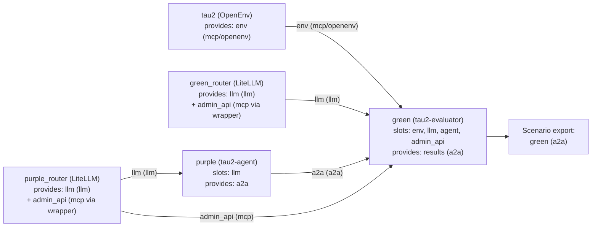
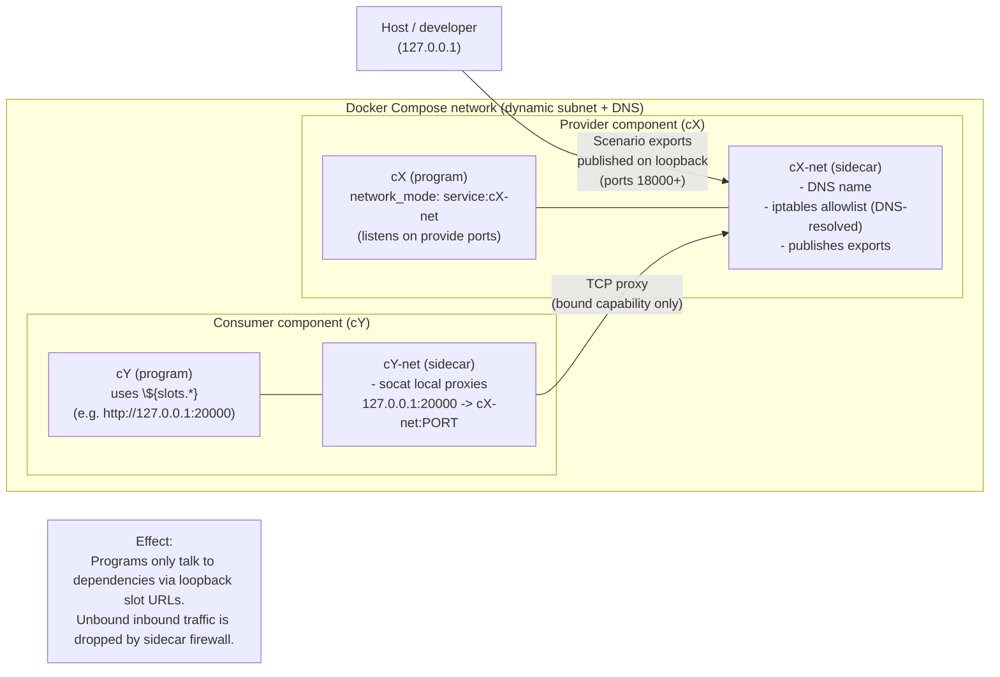

# Amber

Amber is a compiler that turns declarative “agent system” manifests (agents, LLM routers, MCP tools, HTTP services, etc.) into a fully linked, type-checked runtime graph (“Scenario”), then emits artifacts to **understand** it (diagrams) and **run** it (Docker Compose).

---

## What this project does

### 1) From manifests → linked Scenario → runnable output

```mermaid
flowchart LR
  %% Inputs
  M["Component manifests (JSON5)<br/>program + components + slots + provides + bindings + exports"] --> R

  %% Compiler pipeline
  subgraph Compiler["amber-compiler pipeline"]
    R["Resolve tree<br/>(fetch URLs, apply environments/resolvers,<br/>cache by digest)"] --> L
    L["Link + validate<br/>(typecheck bindings,<br/>validate config_schema,<br/>resolve exports)"] --> O
    O["Optimize passes<br/>(DCE + flatten)"] --> S["Scenario<br/>(fully linked graph)"]
  end

  %% Outputs
  S --> IR["Scenario IR (JSON)<br/>primary output"]
  S --> DOT["Graph (Graphviz DOT)<br/>--dot"]
  S --> DC["Docker Compose (YAML)<br/>--docker-compose/--compose"]
  DC --> RUN["docker compose up<br/>(run the system)"]

  %% Note about check vs compile
  CHECK["amber check<br/>(lints + link errors)<br/>(no artifacts)"] -.-> R
  COMPILE["amber compile<br/>(artifacts)"] -.-> R
````

---

### 2) The core idea: typed “capabilities” wired through slots

```mermaid
flowchart TB
  subgraph Parent["Parent manifest (composite component)"]
    Pslots["Parent slots<br/>(what parent needs)"]
    Pkids["Parent components<br/>(#router, #agent, #tools, ...)"]
    Pbind["Parent bindings<br/>wire provides -> slots"]
    Pexp["Parent exports<br/>what the parent exposes upward"]
  end

  subgraph ChildA["Child A (provider)"]
    Aprov["provides:<br/>llm (kind=llm)<br/>admin_api (kind=mcp)"]
  end

  subgraph ChildB["Child B (consumer)"]
    Bslot["slots:<br/>llm (kind=llm)<br/>admin_api (kind=mcp)"]
    Bprog["program:<br/>entrypoint/env can interpolate<br/>\${slots.*} + \${config.*}"]
  end

  ChildA -->|"bind: ChildA.llm → ChildB.llm"| ChildB
  ChildA -->|"bind: ChildA.admin_api → ChildB.admin_api"| ChildB
  Bslot --> Bprog
  Aprov --> Pexp

  L1["Rule: slot kind/profile must match provide kind/profile"]
  L2["Rule: every declared slot must be bound (unless optional exists in future)"]
```

---

### 3) Real example: `examples/tau2/` (agent + evaluator + routers + env)

This is the “tau2” example manifest graph compiled into a Scenario:



---

### 4) How Docker Compose output runs the graph (sidecar-per-component)

The Docker Compose reporter emits **two services per runnable component**:

* a **sidecar** (sets firewall rules + runs local TCP proxies)
* the **program container** (your actual image), sharing the sidecar network namespace

Sidecars run the published image `ghcr.io/rdi-foundation/amber-sidecar:main`.



---

## Quickstart for devs

### Prerequisites

* **Rust toolchain:** `nightly-2025-10-30` (pinned in `rust-toolchain.toml`)
* **Docker + Docker Compose:** needed to run the emitted `docker-compose.yaml`
* **Graphviz (optional):** to render `.dot` files into SVG/PNG

### Build

```bash
# From repo root
cargo build
```

If you don’t have the pinned nightly installed:

```bash
rustup toolchain install nightly-2025-10-30
# optional but convenient if you want to force it:
rustup override set nightly-2025-10-30
```

### Run the CLI

```bash
cargo run -p amber-cli -- --help
```

### Validate an example (typecheck + lints)

```bash
cargo run -p amber-cli -- check examples/tau2/scenario.json5
```

To treat warnings as errors (useful in CI):

```bash
cargo run -p amber-cli -- check -D warnings examples/tau2/scenario.json5
```

### Compile an example and emit artifacts (Scenario IR + DOT + Docker Compose)

`amber compile` requires at least one output flag (`--output`, `--dot`, `--docker-compose`, or `--bundle`).

```bash
rm -rf target/amber-out
cargo run -p amber-cli -- \
  compile \
  --output target/amber-out/scenario \
  --dot target/amber-out/scenario.dot \
  --docker-compose target/amber-out/scenario.docker-compose.yaml \
  examples/tau2/scenario.json5
```

Expected outputs (for the paths above):

* `target/amber-out/scenario` — **primary output** (Scenario IR JSON)
* `target/amber-out/scenario.dot` — graph diagram (Graphviz DOT)
* `target/amber-out/scenario.docker-compose.yaml` — runnable Docker Compose

Render the DOT to SVG:

```bash
dot -Tsvg target/amber-out/scenario.dot -o target/amber-out/scenario.svg
```

### Run the compiled system with Docker Compose

```bash
docker compose -f target/amber-out/scenario.docker-compose.yaml up
```

Finding the host ports for Scenario exports:

* Exports are published on **host loopback** (`127.0.0.1`) starting at port **18000**.
* The compose file includes `x-amber.exports`, a mapping of `export_name -> published_host/published_port/target_port` plus component/provide/endpoint.
* Each `*-net` sidecar service also carries an `amber.exports` label with the same JSON mapping for runtime discovery.

You can still locate the raw publishes under each `*-net` sidecar service’s `ports:` section:

```bash
rg -n "127.0.0.1:18" target/amber-out/scenario.docker-compose.yaml
```

---

## Core concepts (the mental model)

### Manifest vs Scenario

* **Manifest** (authored input, JSON5):

  * describes *one* component
  * may contain child components
  * declares **slots** (inputs) and **provides** (outputs)
  * wires things via **bindings**
  * exposes a public interface via **exports**

* **Scenario** (compiler output):

  * a fully linked component tree with stable component IDs
  * every binding is resolved to concrete `(component, capability)` → `(component, slot)`
  * scenario exports are resolved to concrete provides with their capability type
  * suitable for deterministic tooling (IR/graph/runtime emit)

### Capabilities

A capability is typed by:

* `kind`: one of **`mcp` | `llm` | `http` | `a2a`**
* optional `profile` (commonly for `mcp`, e.g. `openenv`)

**Linking rule:** a slot can only be bound by a provide with the same `(kind, profile)`.

### Bindings and `weak`

A binding expresses:

`(<provider>.<provide>) -> (<consumer>.<slot>)`

`weak: true` means:

* the edge is still a real wiring edge (it will still get proxied / allowed)
* but it does **not** participate in dependency ordering / cycle detection

This is important when you have “peer-ish” connections that shouldn’t force startup ordering.

### Config + config_schema

Manifests can declare `config_schema` (JSON Schema, constrained to Amber's supported profile; see `manifest/README.md`). When a parent instantiates that component
with `components.<name>.config`, the compiler validates the config against the schema at link time.

### Interpolation

Programs can interpolate:

* `${config.<path>}` from the component’s config
* `${slots.<slot>.<field>}` from the resolved slot value

For Docker Compose output, slot fields include:

* `url` (currently emitted as `http://127.0.0.1:<local_port>`)
* `host` (usually `127.0.0.1`)
* `port` (local proxy port)

If you need a non-HTTP scheme, prefer composing your own value using `host` and `port`.

---

## Repo tour

This is a Rust workspace:

* `cli/` (**amber-cli**)
  `amber` executable: `check`, `compile`, `docs manifest`

* `compiler/` (**amber-compiler**)
  resolve tree → link/validate → passes → reporters
  Key modules:

  * `frontend`: resolve manifests (URLs, envs/resolvers, caching, cycle detection)
  * `linker`: typecheck bindings + exports, validate config schema, ensure slots are bound
  * `passes`: graph rewrites (currently DCE + flatten)
  * `reporter`: emit Scenario IR / DOT / Docker Compose YAML

* `manifest/` (**amber-manifest**)
  manifest parsing + validation + linting
  Full format docs live in `manifest/README.md` (also printed via `amber docs manifest`)

* `scenario/` (**amber-scenario**)
  Scenario graph types + graph utilities + Scenario IR conversions

* `docker/amber-sidecar/`
  Dockerfile for the published sidecar image used by the Docker Compose reporter

* `docker/amber-compose-helper/`
  Dockerfile for the helper image used to render runtime config in Docker Compose output

* `examples/`

  * `config-forwarding/`: root config forwarding into a child component
  * `tau2/`: end-to-end agent/evaluator/router/env composition
  * `reexport/`: minimal example demonstrating export forwarding through components

* `node/` (**amber-node**)
  placeholder crate for future standalone runtime functionality

---

## Extending the system (common dev tasks)

### Add a new output artifact (reporter)

1. Implement `Reporter` in `compiler/src/reporter/*`.
2. Wire it into `amber-cli` as a `--flag` under `CompileArgs`.
3. Add a CLI test under `cli/tests/compile_outputs.rs` or a new one.

### Add a new optimization pass

1. Implement `ScenarioPass` (`compiler/src/passes/mod.rs`).
2. Register it in the pass manager sequence (currently DCE then flatten).
3. Ensure you preserve scenario invariants (`Scenario::assert_invariants()` is used in debug).

### Add a new capability kind

You’ll need to update:

* manifest types / parsing (`amber-manifest`)
* any link-time compatibility checks (`amber-compiler` linker)
* tooling assumptions (e.g., Docker Compose reporter may have protocol limitations)

---

## Testing

Run everything:

```bash
cargo test
```

CLI-focused tests:

```bash
cargo test -p amber-cli
```

UI tests live in `cli/tests/ui/`:

* each `*.json5` case has an expected `*.stderr` (and optionally `*.stdout`)
* tests run `amber check` and compare normalized output

---

## Known limitations (current behavior)

* Docker Compose slot wiring is implemented as **TCP forwarding** (via `socat`) plus an iptables allowlist in each sidecar.
* If two provides route to different endpoints on the same port, Compose emission will fail (an L4 backend can’t separate them).
